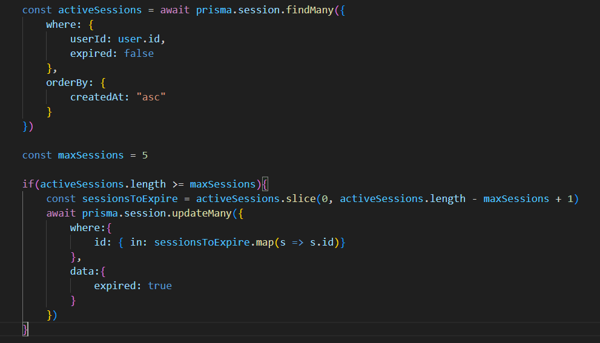

# Algorítmo para expirar sessões

## Esse algorítmo expira sessões antigas com base em um limitador de sessões, antes de criar novas sessões.

### Para que ele funcione corretamente, é importante que o array de sessões seja ordenado das sessões mais antigas para as mais novas. Evitando a expiração de sessões aleatórias.

## Exemplo real com Prisma

